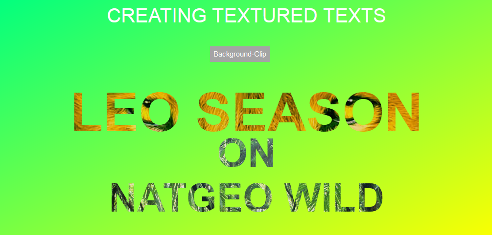

# Texture-Texts
In this repo, I explored the use of texture texts in design.

Often times, design either do not use texture texts or when they do they overdo it. 
So I tried making it as simple as possible, with a relatable example too. I used the promotion screen on NATGEO WILD as backdrop for this design. It's an initial design, which means there is always room for improvement.  

